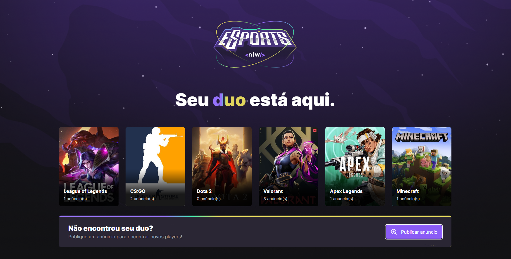
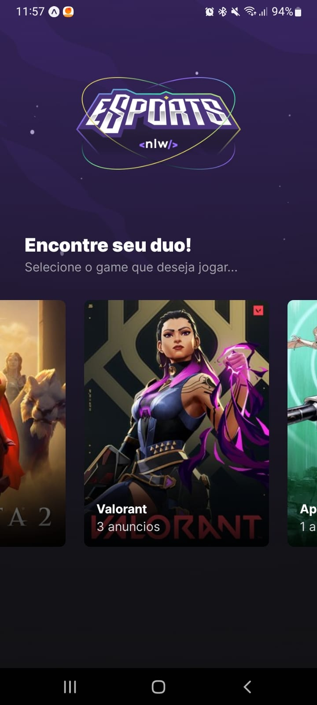

# NLW eSportes

Evento realizado pela rockeatSeat
```
https://app.rocketseat.com.br/dashboard
```
<br>
Participei da trilha Ignite que o desafio era criar um FindYourDuo para encontrar pessoas online para jogar junto.<br>
A versão web foi desenvolvida utilizando reactjs e a versão mobile foi programada com react native realizando testes na ferramenta expo.


  

<br>

# Como realizar testes

1. Dentro da pasta server execute o comando
```
npm run dev
```

Com o servidor iniciado entre na pasta web ou mobile dependendo de qual voce deseja acessar<br>
2. Caso voce deseje o web execute no terminal
```
npm run dev
```

3. Caso voce deseje o web execute no terminal
```
expo start
```

OBS: para testar o mobile é necessario ter o app do expo isntalado em seu dispositivo android ou ios<br>
4. SE DIVIRTA!
